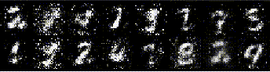

<div align="center">

<!-- Header Banner -->


<br/>

# ⚡ Simple GAN — MNIST Digit Generation

### *Teaching a neural network to dream in digits*

[](https://python.org)
[](https://pytorch.org)
[](http://yann.lecun.com/exdb/mnist/)
[](LICENSE)

</div>

---

## 🧠 What Is This?

A clean, from-scratch implementation of a **Generative Adversarial Network (GAN)** trained on the MNIST handwritten digits dataset.

The model learns to generate realistic handwritten digits — starting from pure random noise — through an adversarial game between two neural networks:

| Network | Role | Goal |
|---|---|---|
| 🎭 **Generator** | Creates fake images from noise | Fool the Discriminator |
| 🔍 **Discriminator** | Classifies real vs. fake | Catch the Generator's fakes |

They train together. They get better together. The result? A Generator that can conjure convincing digits out of thin air.

---

## 🎬 Training in Action

> **Pure noise → handwritten digits** — watch the Generator learn over 200 epochs:

<div align="center">
  
  <br/>
</div>

---

## 🏗️ Architecture

```
Generator
─────────────────────────────────────────────────────
  Input:  z ~ N(0,1)   [100-dim noise vector]
  Linear(100 → 128)  →  LeakyReLU
  Linear(128 → 128)  →  LeakyReLU
  Linear(128 → 784)  →  Tanh
  Output: fake image  [784-dim = 28×28]

Discriminator
─────────────────────────────────────────────────────
  Input:  flattened image  [784-dim]
  Linear(784 → 128)  →  LeakyReLU
  Linear(128 → 128)  →  LeakyReLU
  Linear(128 → 1)    →  Sigmoid
  Output: P(real)  [scalar ∈ (0,1)]
```

---

## ⚙️ Training Details

| Hyperparameter | Value |
|---|---|
| Optimizer | Adam |
| Learning Rate | `0.0005` |
| Batch Size | `100` |
| Epochs | `200` |
| Loss Function | Binary Cross-Entropy (BCE) |
| Latent Dimension `z` | `100` |
| Hidden Units | `128` |
| Activation | LeakyReLU + Tanh (G) / Sigmoid (D) |
| Device | CUDA / CPU (auto-detect) |

---

## 🧠 Pretrained Model

The trained Generator weights are included — no need to train from scratch.

```python
import torch
import torch.nn as nn

class Generator(nn.Module):
    def __init__(self, in_features, hidden_features):
        super().__init__()
        self.gen = nn.Sequential(
            nn.Linear(in_features, hidden_features), nn.LeakyReLU(),
            nn.Linear(hidden_features, hidden_features), nn.LeakyReLU(),
            nn.Linear(hidden_features, 784), nn.Tanh()
        )
    def forward(self, x):
        return self.gen(x)

# Load the model
gen = Generator(in_features=100, hidden_features=128)
gen.load_state_dict(torch.load('generator_model.pt', map_location='cpu'))
gen.eval()

# Generate digits
noise = torch.randn(16, 100)
with torch.no_grad():
    fake_images = gen(noise).reshape(-1, 1, 28, 28)
```

---

## 🚀 Getting Started

### 1. Clone the repo

```bash
git clone https://github.com/YOUR_USERNAME/simple-gan-mnist.git
cd simple-gan-mnist
```

### 2. Install dependencies

```bash
pip install torch torchvision tensorboard
```

### 3. Run training

```bash
jupyter notebook gan_mnist.ipynb
```

> MNIST will auto-download to `./data/` on first run.

---

## 📊 Loss Curves

Training a GAN is a **balancing act** — ideally, both losses converge and stabilize rather than one dominating the other.

```
Epoch   1  |  Disc Loss: 1.38  |  Gen Loss: 0.69
Epoch  50  |  Disc Loss: 0.91  |  Gen Loss: 1.12
Epoch 100  |  Disc Loss: 0.72  |  Gen Loss: 1.40
Epoch 200  |  Disc Loss: 0.65  |  Gen Loss: 1.55
```

*(Approximate values — actual results may vary by run)*

---

## 📁 Project Structure

```
simple-gan-mnist/
│
├── simple_gan.ipynb        # Main training notebook
├── generator_model.pt     # Pretrained Generator weights
├── assets/
│   └── cropped_gans.gif   # Generator progress animation
├── data/                  # MNIST dataset (auto-downloaded)
├── runs/                  # TensorBoard logs
└── README.md
```

---

## 🔮 What's Next?

Potential improvements and experiments to try:

- [ ] **DCGAN** — swap Linear layers for Convolutions for sharper images
- [ ] **Conditional GAN** — generate a specific digit on demand
- [ ] **WGAN** — Wasserstein loss for more stable training
- [ ] **Interpolation** — walk through the latent space between two digits
- [ ] **FID Score** — quantitatively evaluate image quality

---

## 📖 References

- Goodfellow et al. — [*Generative Adversarial Nets*](https://arxiv.org/abs/1406.2661) (2014)
- [PyTorch Documentation](https://pytorch.org/docs/stable/index.html)
- [MNIST Dataset](http://yann.lecun.com/exdb/mnist/)

---

<div align="center">

Made with 🔥 and PyTorch

*"The Generator doesn't know what a digit looks like. It just learns what the Discriminator hates."*

</div>
