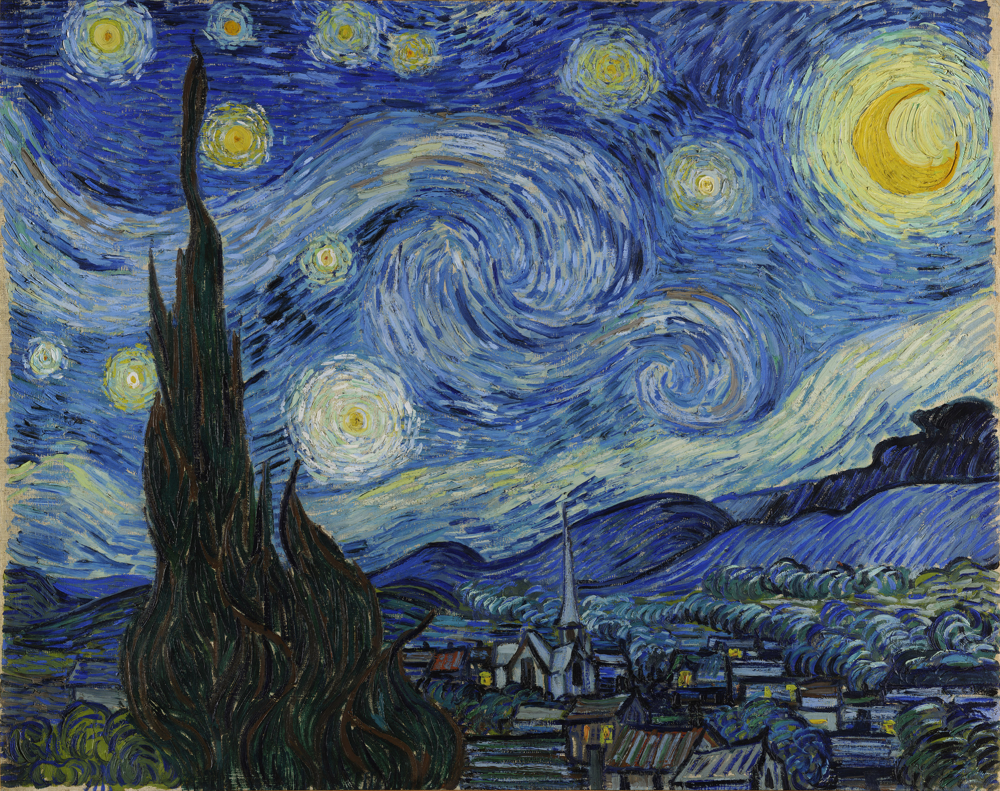
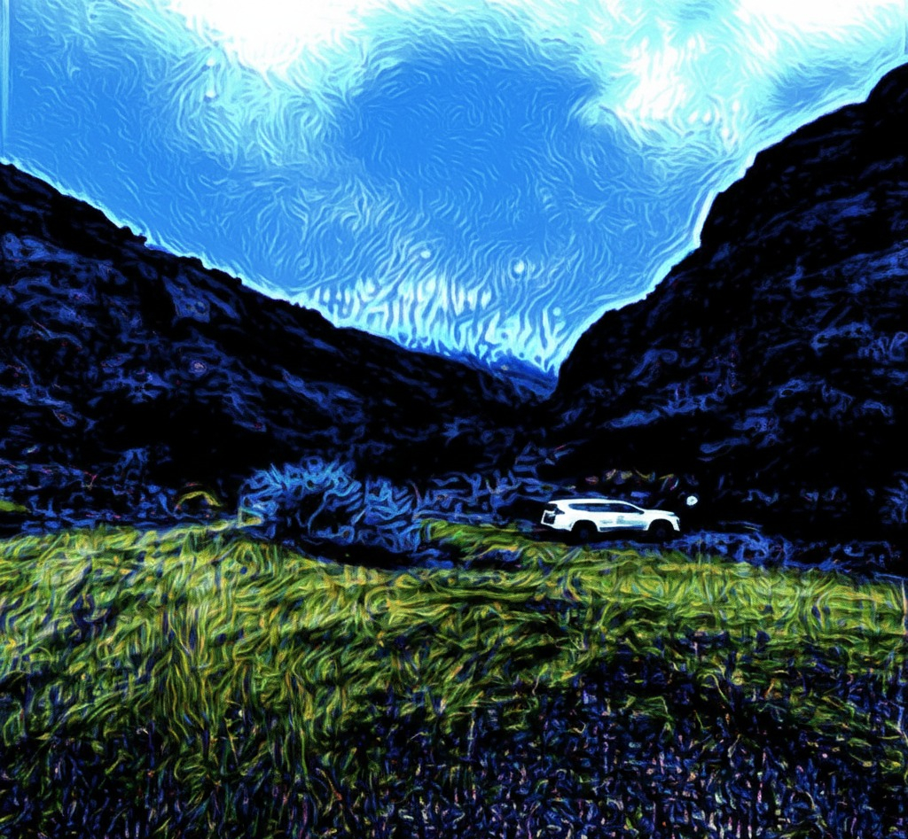

# 🎨 Neural Style Transfer (NST) using PyTorch

This repository contains a PyTorch implementation of the Neural Style Transfer algorithm. By leveraging the feature representations of a Convolutional Neural Network (CNN), this project synthesizes a new image that seamlessly combines the structural content of one image with the visual style and texture of another.

## 🌟 Overview & Architecture

The core of this implementation relies on **VGG19**, a deep pre-trained CNN. Instead of training the network weights, we freeze the model and use it purely as a feature extractor. We then perform gradient descent directly on the pixel space of the target image.

* **Content Representation:** Extracted from deeper layers to capture high-level spatial structures and macro-geometry.
* **Style Representation:** Extracted across multiple layers (from shallow to deep) using a **Gram Matrix**. This computes the inner product between vectorized feature maps, effectively capturing texture, color palettes, and brushstrokes irrespective of spatial arrangement.

---

## 🖼️ Visual Results

Here is the transformation showcasing the algorithm's capability:

<div align="center">

| Content Image | Style Image | Synthesized Output |
| :---: | :---: | :---: |
|  |  |  |

</div>

---

## 🧠 Mathematical Formulation

The optimization objective is to minimize a total loss function that is a weighted linear combination of Content Loss and Style Loss:

$$\mathcal{L}_{total} = \alpha \mathcal{L}_{content} + \beta \mathcal{L}_{style}$$

### 1. Content Loss
Measures the Mean Squared Error (MSE) between the feature maps of the content image ($C$) and the generated image ($G$) at a specific layer $l$:

$$\mathcal{L}_{content} = \frac{1}{2} \sum_{i,j} (F_{i,j}^l(G) - P_{i,j}^l(C))^2$$

### 2. Style Loss
Measures the MSE between the Gram Matrices ($Gram$) of the style image ($S$) and the generated image ($G$). The Gram Matrix is given by $G = F F^T$:

$$\mathcal{L}_{style} = \sum_{l} w_l \frac{1}{4N_l^2 M_l^2} \sum_{i,j} (Gram_{i,j}^l(G) - Gram_{i,j}^l(S))^2$$

---

## ⚙️ Implementation Details & Hyperparameters

* **Framework:** PyTorch
* **Backbone:** VGG19 (Weights: ImageNet, `requires_grad=False`)
* **Optimizer:** Adam (`lr = 0.01`)
* **Epochs:** 1000
* **Target Image Initialization:** Cloned from the content image for faster convergence.

### Feature Extraction Layers
To achieve the optimal balance between structure and texture, specific activation layers were targeted:
* **Content Layer:** `[22]`
* **Style Layers:** `[1, 6, 11, 20, 26]`
* **Weights:** Content Weight ($\alpha$) = $1$, Style Weight ($\beta$) = $10^9$

---

## 🚀 Getting Started

### Prerequisites
Ensure you have the required dependencies installed:
```bash
pip install torch torchvision numpy matplotlib pillow
```
